# CellSense

An AI-powered Google Sheets add-on that generates spreadsheet formulas from plain English instructions.

> **Note:** The hosted instance is currently unavailable due to GCP billing issues. Screenshots below show the product in action.

---

## 1. What It Does

- **Formula generation from natural language** — describe what you want, get working formulas applied to your sheet.
- **Multi-turn chat** — follow up on previous instructions within the same conversation. Up to 30 recent messages are sent as context.
- **Cell context selection** — attach specific cell ranges as context so the model understands your data.
- **Multi-range editing** — a single request can write formulas to multiple cell ranges at once.
- **Multiple LLM providers** — choose between Google Gemini, OpenAI GPT, and Anthropic Claude.
- **Free tier with daily quota** — 10 free requests/day using the system Gemini key. Bring your own API key for unlimited use with any provider.
- **API key management** — set, change, or delete API keys for each provider from the profile page.
- **Revert edits** — undo the last set of applied formulas with one click.

---

## 2. Supported Models

| Provider | Models |
|----------|--------|
| Google Gemini | `gemini-2.5-pro`, `gemini-2.5-flash` |
| OpenAI GPT | `gpt-5`, `gpt-5-mini` |
| Anthropic Claude | `claude-opus-4-5`, `claude-haiku-4-5` |

Three models were removed after evaluation (see [Section 8 — LLM Evaluation](#8-llm-evaluation)): Gemini 2.5 Flash Lite, GPT-5 Nano, and Claude Sonnet 4.5.

---

## 3. Architecture Overview

The system has four main components:

1. **Frontend** — a Google Apps Script sidebar embedded in Google Sheets (TypeScript, HTML). Managed as a Git submodule at `./google_apps_script/`.
2. **Backend** — a FastAPI server handling chat logic, LLM calls, and user management.
3. **Database** — PostgreSQL storing users, chats, messages, and quota tracking.
4. **Cloud infrastructure** — hosted on GCP: Cloud Run (backend), Cloud SQL (database), Artifact Registry (Docker images), Apps Script (frontend).

Here's an example spreadsheet the add-on works with:

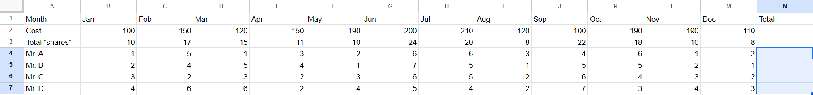

And a more complex sheet with student grades, exercise scores, and weighted calculations:


---

## 4. Project Structure

```
server/
├── main.py                # FastAPI app, middleware, health endpoints
├── config.py              # Environment variables and constants
├── constants.py           # Enums (LLMProviders, LLMModels, ChatRoles)
├── routers/               # API endpoint handlers
├── services/              # Business logic
├── crud/                  # Database operations (SQLAlchemy)
├── middleware/             # Request verification and processing
├── prompts/               # Jinja2 prompt templates
└── utils/                 # Helpers

google_apps_script/        # Frontend (Git submodule)
├── src/                   # TypeScript source + HTML templates
├── dist/                  # Built output pushed to Apps Script
└── scripts/               # Build helpers

alembic/                   # Database migrations
evaluation/                # LLM evaluation scripts and results
tests/                     # pytest test suite
```

### API Endpoints

| Method | Path | Description |
|--------|------|-------------|
| `GET` | `/healthz` | Health check |
| `GET` | `/supported-models` | List available LLM models |
| `POST` | `/chat/new` | Create a new chat session |
| `GET` | `/chat/list` | Get user's chat sessions |
| `GET` | `/chat/{chat_id}/messages` | Get messages in a chat |
| `POST` | `/chat/{chat_id}/send-message` | Send message and get AI response |
| `GET` | `/user/me` | Get current user info |
| `GET` | `/user/quota` | Get free tier quota |
| `PATCH` | `/user/api-key` | Update personal API keys |

---

## 5. How It Works

The prompt pipeline:

1. User types a natural language instruction and selects context cells + target cells.
2. The frontend sends a JSON payload to the backend with the message, selected ranges (context), and target ranges.
3. The backend builds a prompt using a Jinja2 template (`server/prompts/llm_request_prompt.md`) that defines the LLM as a "spreadsheet reasoning agent".
4. Previous messages from the chat (up to 30) are prepended for multi-turn context.
5. The LLM receives structured JSON input:

```json
{
  "decoded_message": "calculate total cost for each person...",
  "selected_ranges": [
    { "sheet_name": "Sheet1", "range": "A1:N7", "cell_values": [[...]] }
  ],
  "target_ranges": [
    { "sheet_name": "Sheet1", "range": "N4:N7", "cell_values": [[...]] }
  ]
}
```

6. The LLM returns structured JSON output:

```json
{
  "message": "I calculated the totals by summing...",
  "filled_ranges": [
    { "sheet_name": "Sheet1", "range": "N4:N7", "a1_value": "=SUM(...)" }
  ]
}
```

7. The backend sends the response to the frontend, which displays the explanation and applies the formulas to the target cells.

Here's what the full prompt looks like in the database:

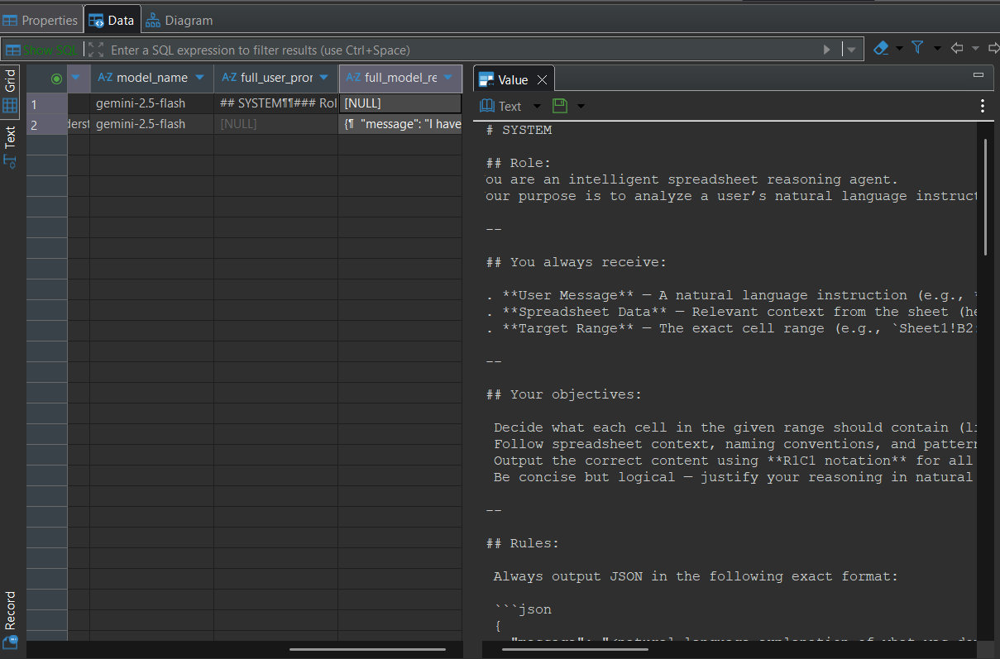

And the full LLM response:

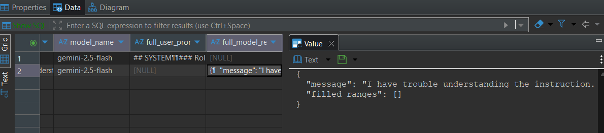

---

## 6. Database Schema

Five tables managed by Alembic migrations:

| Table | Purpose |
|-------|---------|
| `users` | User accounts and encrypted API keys |
| `chats` | Chat sessions per user |
| `chat_messages` | Messages within chats |
| `free_user_quota` | Daily free request quota tracking |
| `system_api_key_usage` | System API key daily usage limits |

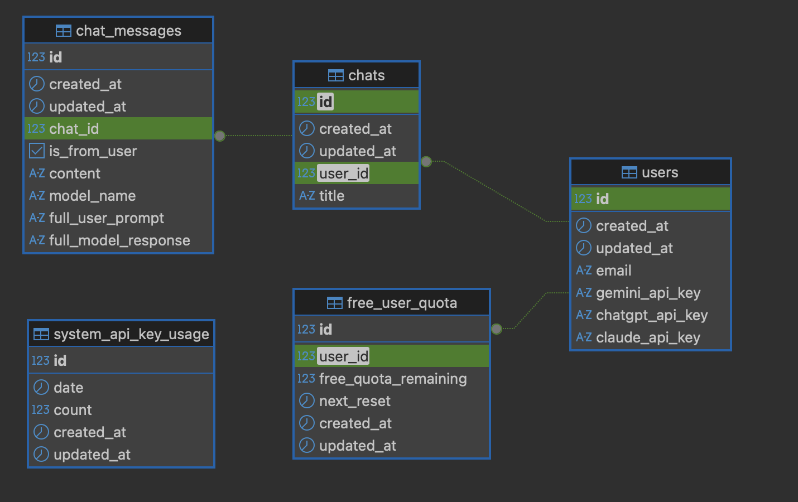

---

## 7. Security

- **OIDC authentication** — the Apps Script frontend attaches a Google-signed OIDC token (JWT) to every request. The backend verifies the signature and checks that the audience matches the Apps Script's OAuth client ID. This confirms both the token's authenticity and that it was issued for CellSense specifically.
- **Timestamp verification** — requests older than 1 minute are rejected to prevent replay attacks.
- **Encrypted API keys** — user-provided API keys are encrypted before storage in the database.

---

## 8. LLM Evaluation

Nine models across three providers were evaluated on Google Sheets formula generation tasks. The test set had 9 sheets across 3 difficulty levels (Easy, Medium, Hard), with each model attempting each task 3 times.

**Metrics:**
- **Consistency** — are the 3 attempts identical and correct? Graded Y (yes), D (different but same result), C (same result only due to specific data), N (different results).
- **Style** — is the formula concise and efficient? Graded Y/N.

### Consistency Results

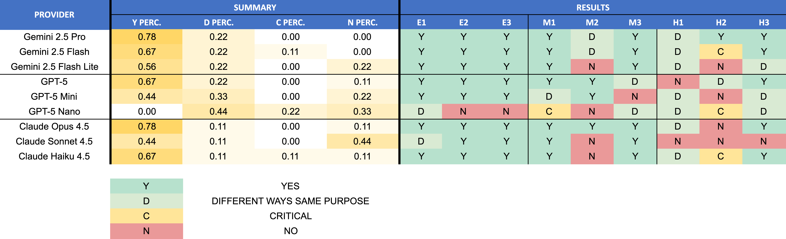

### Style Results

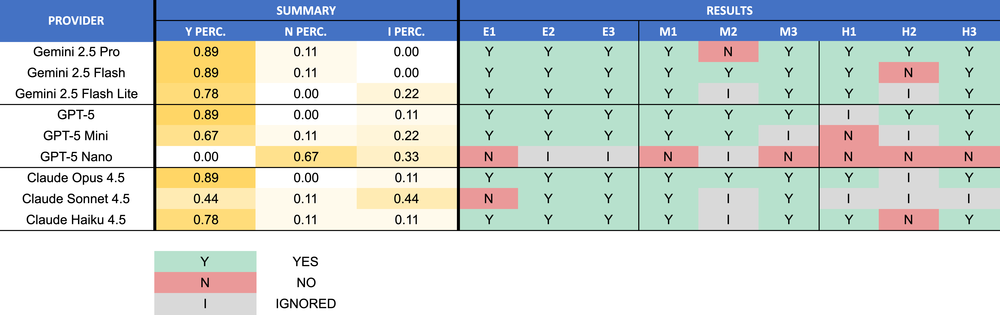

### Models Removed

After evaluation, three models were dropped for producing incorrect or inconsistent formulas:
- **Gemini 2.5 Flash Lite** — failed on M2 and H2
- **GPT-5 Nano** — frequent errors, redundant cell-by-cell formulas, escape character issues
- **Claude Sonnet 4.5** — JSON parsing errors, failed on multiple sheets

<details>
<summary>Evaluation test sheets (click to expand)</summary>

#### Easy

| | |
|---|---|
| 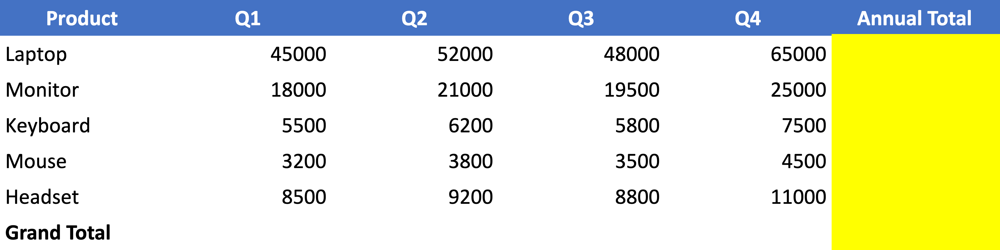 | 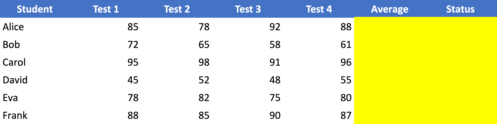 |
| **E1:** Sales revenue totals | **E2:** Student grade averages and pass/fail |

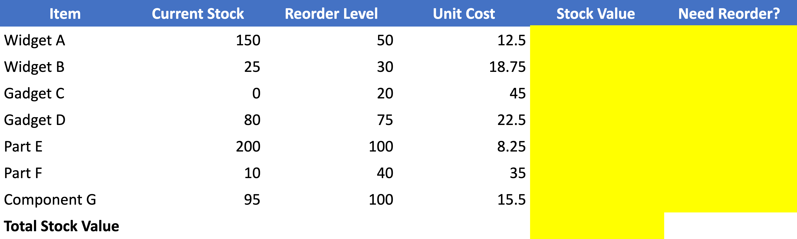

**E3:** Inventory stock value and reorder alerts

#### Medium

| | |
|---|---|
| 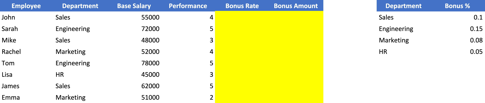 | 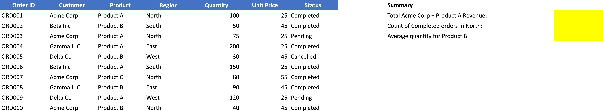 |
| **M1:** Employee bonus with VLOOKUP | **M2:** Order analysis with SUMIFS/COUNTIFS |

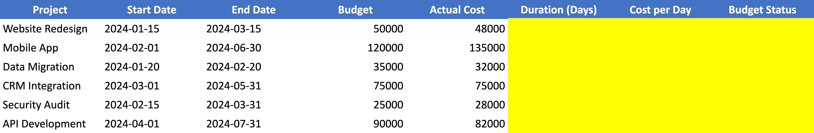

**M3:** Project duration and budget status

#### Hard

| | |
|---|---|
| 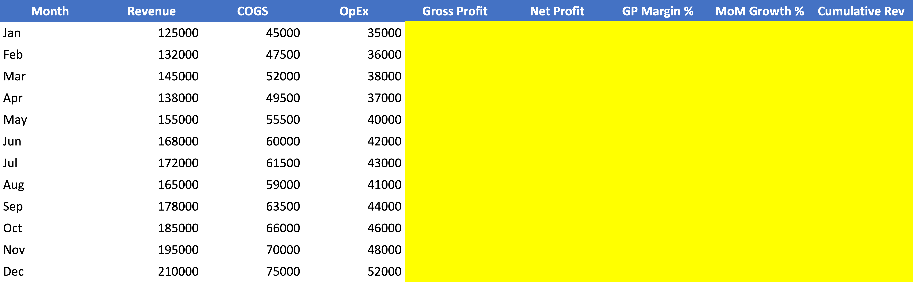 | 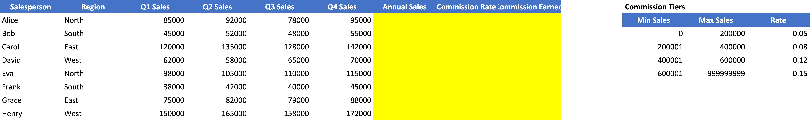 |
| **H1:** Financial metrics with running totals | **H2:** Tiered commission with lookup |

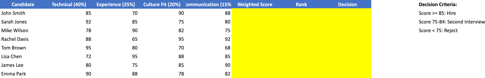

**H3:** Weighted scoring with ranking

</details>

---

## 9. Tech Stack

- **Backend:** Python 3.11, FastAPI, SQLAlchemy, Alembic, Jinja2
- **Frontend:** TypeScript, Google Apps Script, esbuild
- **Database:** PostgreSQL 16
- **LLM SDKs:** google-genai, openai, anthropic
- **Infrastructure:** GCP Cloud Run, Cloud SQL, Artifact Registry
- **Auth:** Google OIDC (JWT)
- **Testing:** pytest, pytest-asyncio
- **Code quality:** Ruff, Pyright, Black, isort, Bandit, detect-secrets (via pre-commit)

---

## 10. Testing

Tests run against a separate PostgreSQL instance. Each test gets a fresh database session that rolls back after execution.

```bash
# Run the full test suite (spins up test DB, migrates, runs tests, cleans up)
make run_test

# Or run steps individually:
make pre_test           # Start test DB and migrate
make test               # Run all tests
make test DIR=service_tests  # Run a specific test directory
make post_test          # Tear down test DB
```

---

## 11. Screenshots

<table>
  <tr>
    <td>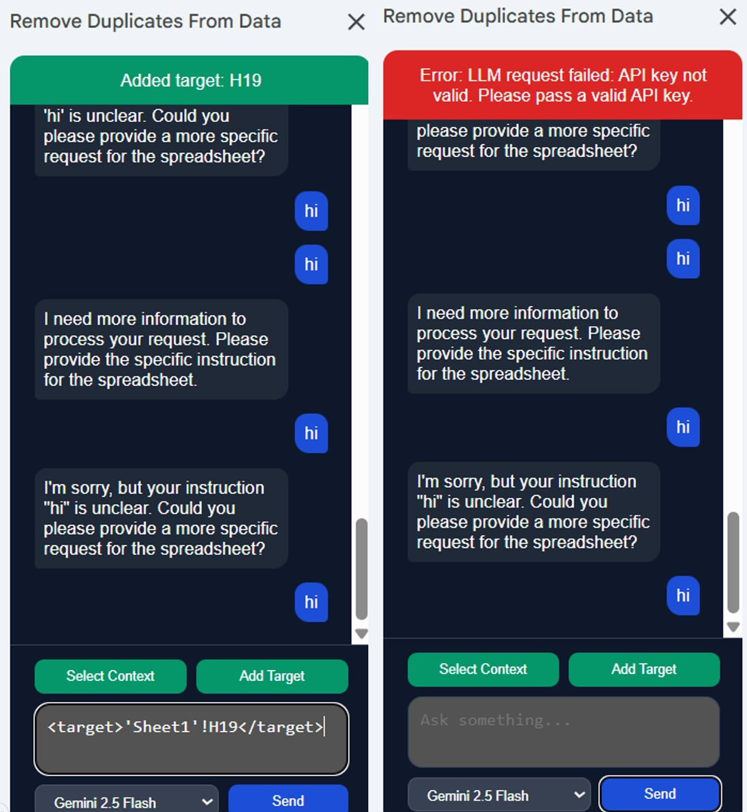</td>
    <td>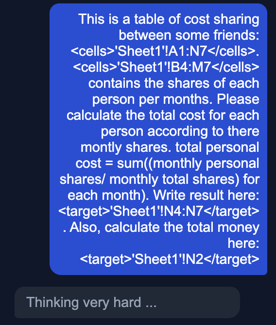</td>
  </tr>
  <tr>
    <td><em>Chat interface — multi-turn conversation, error banners, info messages</em></td>
    <td><em>Loading indicator while the model thinks</em></td>
  </tr>
  <tr>
    <td>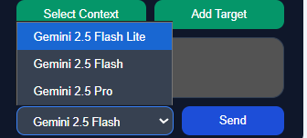</td>
    <td>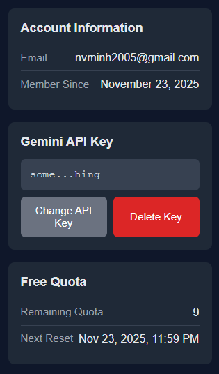</td>
  </tr>
  <tr>
    <td><em>Pick your model — Gemini, GPT, or Claude</em></td>
    <td><em>Profile page — API key management and free quota</em></td>
  </tr>
  <tr>
    <td>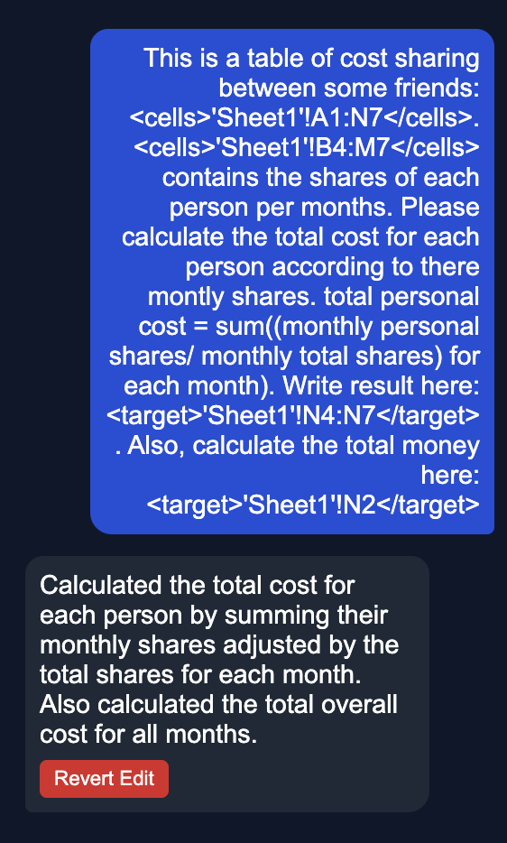</td>
    <td>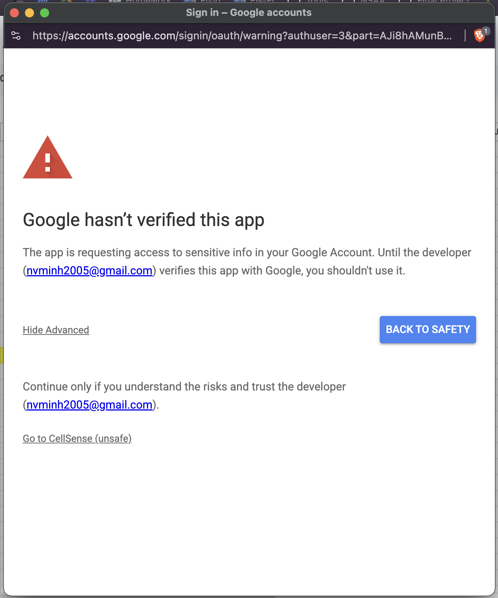</td>
  </tr>
  <tr>
    <td><em>One-click revert after formulas are applied</em></td>
    <td><em>Google's authorization prompt for the add-on</em></td>
  </tr>
</table>
