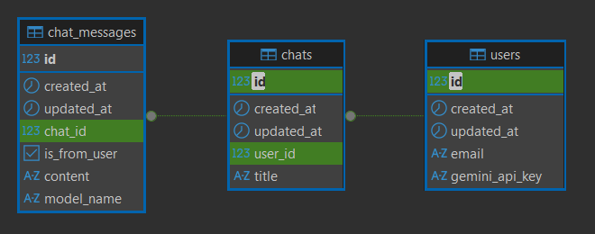
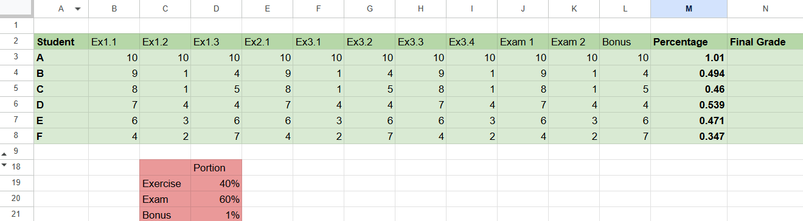

# Meeting Report - November 18, 2025

## Progress Since Last Meeting:
- Implemented user management and chat management with tests. This enables:
    - Saving chat messages to database.
    - Retrieving chat history for a user.
- Migrated the frontend part to its own repository. The frontend is now writen in Typescript, then got compiled into a single JavaScript entry to be pushed to Google Apps Script. The frontend also includes a `types.ts`, which is generated using FastAPI's OpenAPI schema, ensuring type safety between frontend and backend.
- Implemented editing multiple ranges in one request.
- Use LLM to infer chat title from the first user message.
- Use signature to verify requests indeed from Google Apps Script and use timestamps to reject old requests (preventing replay attacks).

## Chat and User Schemas


### A few notes:
- `user_email` is a mandatory field in every request, used to identify the user. If the user does not exist, a new user will be created.
- The field `model_name` for users' messages are requested model. The field `model_email` for LLM messages are actual model used.

## New Frontend Repository
- The frontend code has been moved to its own repository: https://github.com/nguyenvuminhh/cell-sense-gas
- Structure of the frontend repository:
```
.
├── src/
│   ├── html/
│   │   ├── chat_interface.html
│   │   ├── ...
│   │   └── <other html files>
│   ├── services/
│   │   ├── chatService.ts
│   │   ├── apiService.ts
│   │   ├── ...
│   │   └── <other service files>
│   ├── Code.ts
│   ├── index.ts    // This is the main entrypoint, importing all the necessary functions
│   ├── config.ts   // This contains the constants and types
│   └── type.ts     // This file is the OpenAPI documentation, generated by FastAPI
└── dist/
│   ├── html/       // This folder is copied from src/html
│   ├── Code.js     // This file is compiled from src/index.ts
│   └── <other json config files>
└── <other config files>
```
- Push pipeline:
    - The `src/index.ts` is compiled using Esbuild into a single `dist/Code.js`.
    - The `src/html` folder is copied to `dist/html/`.
    - Other config files (e.g., `appsscript.json` and `.clasp.json`) are also copied to `dist/`.
    - The `dist/` folder is then pushed to Google Apps Script using `clasp`.

## Mutli-range Editing
- The user can now select multiple ranges in Google Sheets.
- Now, when clicking the set target button, instead of seeing a single range in a field, the user will see the currently selected ranges inside tag `<target></target>` in the text field. This allows the user to request edits on multiple ranges in one go, and to describe what they want to do with each target more easily. Example:
> This is a table of [...]
> Please do sth here: &lt;target&gt;'Sheet1'!N4:N7&lt;/target&gt;.
> Also, calculate sth here: &lt;target&gt;'Sheet1'!N2&lt;/target&gt;.

## Comparison between having frontend and backend codes in the same repository vs separate repositories
### Single Repository (Previous Approach)
- Easier to manage dependencies and versions since everything is in one place.
- For small project, it is easier to write code since everything is in one IDE window.
- For a plain JavaScript + HTML frontend (no config files, build tools, package files), it is simpler to have the frontend code in the same repository as the backend.
### Separate Repositories (Current Approach)
- Allows for config files, build tools, package files, etc. in the frontend without cluttering the backend repository.
- Allows precommit hooks (e.g., linting, formatting, type checking) dedicated for the frontend code.
- Allows easier Typescript building and bundling process using tools like Esbuild, Webpack, etc. (which usually require their own config files and package files).

## Comparison between Esbuild vs Webpack for building and bundling the Typescript frontend
### Esbuild (Current Approach)
- Extremely fast build times (in milliseconds).
- No need for complex configuration files; it can be used with a single command line with zero config.
- Support JS, TS, JSX, TSX, and CSS out of the box. (This project only needs TS)

### Webpack
- More mature and widely used in the industry.
- More complex configuration, which can be a pro or con depending on the project needs.
- More plugins and loaders available for various use cases.

### Since this project only needs to compile a simple Typescript code into a single JavaScript file without any complex requirements, Esbuild is a better fit due to its simplicity and speed.

## LLM-based Chat Title Generation
- When a new chat is created, if the title is still "New Chat" (default title), the backend will send the first user message to the LLM with a prompt to generate a concise title for the chat.
- The generated title will then be updated in the database for that chat.
- If the content is too vague or unclear, the LLM may return an empty string, in which case the title remains "New Chat".

## Signature Verification for Requests from Google Apps Script
### Steps:
1. Generate a 4096-bit RSA key pair (public and private keys)
2. Store the private key securely in the Google Secrets Manager.
3. Store the public key in the backend server under `assets/` (no extra security needed since it's public).
4. To fetch the private key in Google Apps Script, use the Secret Manager API to retrieve it when needed. A Bearer token is required to authenticate the request to the Secret Manager API. In this case, the token is the OAuth token of the Apps Script project itself, which can be obtained using `ScriptApp.getOAuthToken()`.
5. The private key is cached for 6 hours to avoid frequent API calls.
6. When sending a request from the Apps Script to the backend, sign the request payload and url using the private key and include the signature in the request headers.
```
signature = Sign(PrivateKey, SHA256(RequestBody + RequestURL))
verifed = Verify(PublicKey, SHA256(RequestBody + RequestURL), signature)
```
7. In the backend, verify the signature using the public key in the first middleware. If the signature is valid, proceed with processing the request; otherwise, reject the request.

This model is inspired by how webhooks are secured using signatures (I observed from working with [Twilio](https://www.twilio.com/docs/usage/security#validating-requests)), ensuring that requests are indeed from the trusted source.

## Timestamp-based Replay Attack Prevention
- Each request from the Apps Script includes a timestamp in the URL query parameters.
- The backend checks if the timestamp is within an acceptable range (e.g., within the last 1 minutes).
- If the timestamp is too old, the request is rejected to prevent replay attacks.
- This prevents the attacker to capture a valid request (including the signature) and resend it later to perform unauthorized actions.

## Observation:


User message: `This is a table of students' exercises', exams' and bonus grade: <cells>'Sheet4'!A2:N8</cells>. The maximum point for each column (Ex1.1, Exam1, etc.) is 10. Here is the portion of each part <cells>'Sheet4'!C18:D21</cells>. Each section of a part (Exam 1 under Exam) shares the same weight. Each subsection of a section (Ex1.1 under Ex1) also shares the same weight. This means if there are 3 Ex, each Ex would have 1/3 of the portion. And if Ex1 has 2 sub Ex, each would have 1/6. If Ex2 has 1 sub Ex, it would have all 1/3. Please calculate the mark percentage of each student here: <target>'Sheet4'!M3:M8</target>.`

Eventhough the user has specified that each section under a part shares the same weight, and each subsection under a section also shares the same weight, the LLM failed to infer this correctly and averaged all the columns equally in a part. It did correctly use the right weights from the portion table, but it did not apply the equal sharing logic specified by the user.

**Expected Output (notice ex_percentage):**
```
ex1_percentage = (ex1.1 + ex1.2 + ex1.3) / 30
ex2_percentage = (ex2.1) / 10
ex3_percentage = (ex3.1 + ex3.2 + ex3.3 + ex3.4) / 40

ex_percentage = (ex1_percentage + ex2_percentage + ex3_percentage)/ 3
exam_percentage = (exam1 + exam2) / 20

final_grade = ex_percentage * ex_portion + exam_percentage * exam_portion + bonus * bonus_portion
```

**GEMINI 2.5 PRO Output (notice ex_percentage):**
```
ex_percentage = avg(ex1.1, ex1.2, ex1.3, ex2.1, ex3.1, ex3.2, ex3.3, ex3.4) / 10
exam_percentage = avg(exam1, exam2) / 10

final_grade = ex_percentage * ex_portion + exam_percentage * exam_portion + bonus * bonus_portion
```
